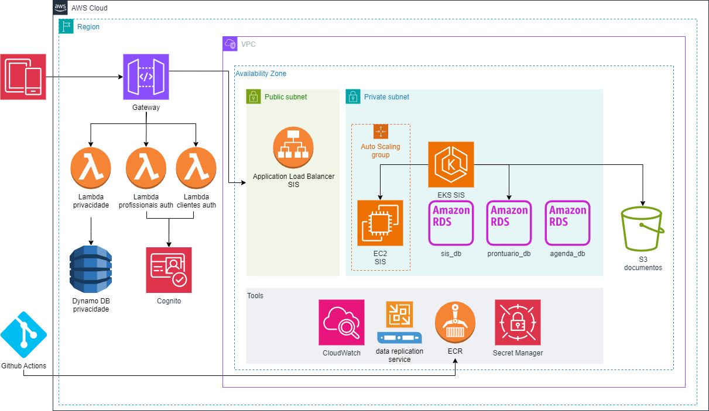
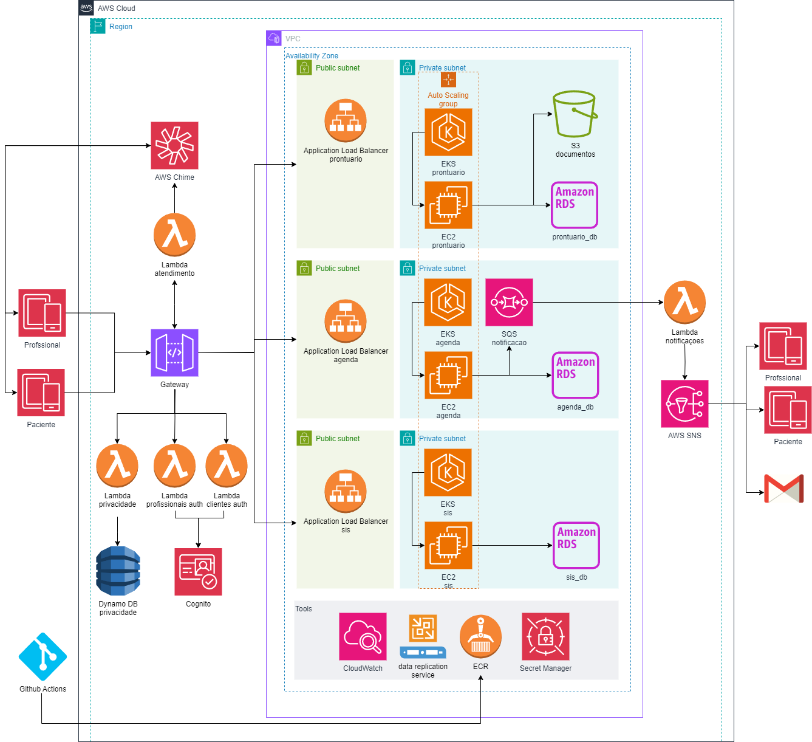
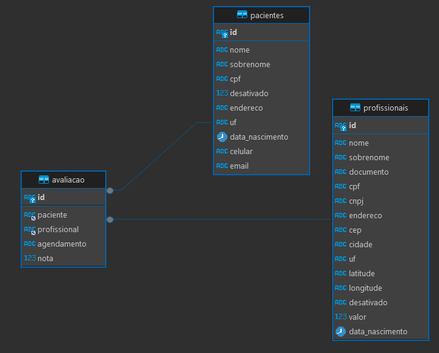
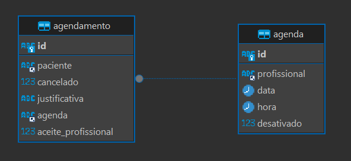
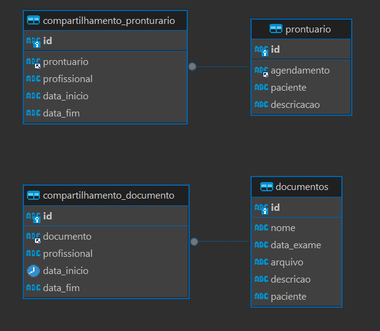
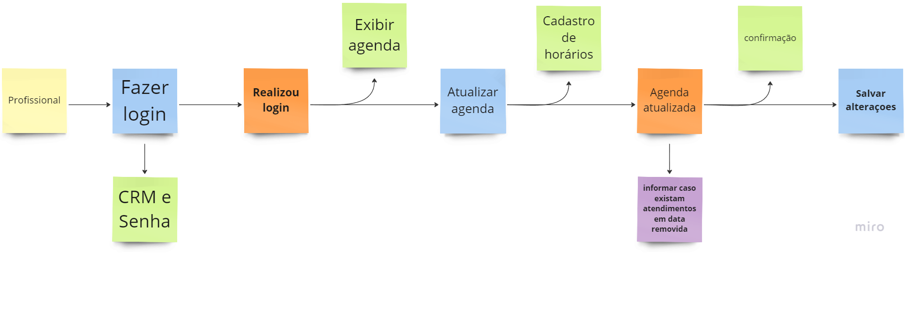
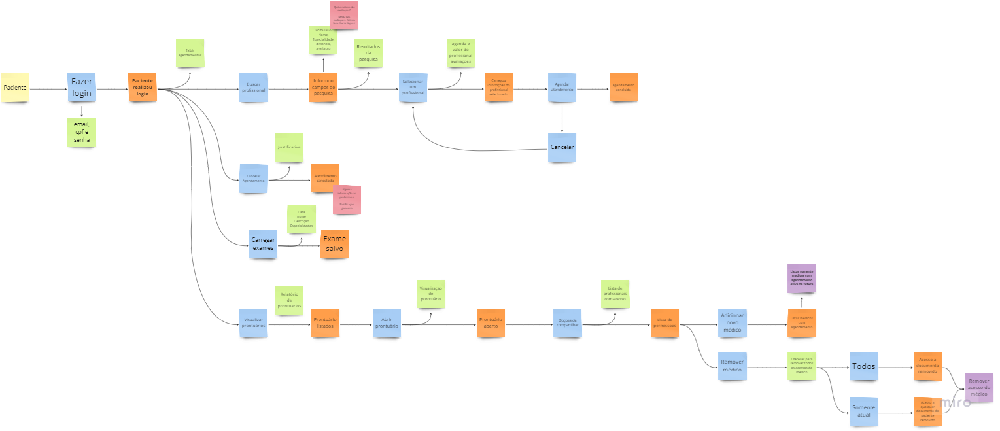
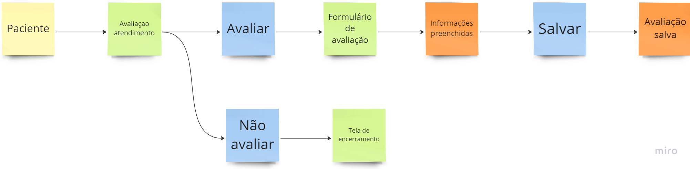

# Hackathon FIAP
Sistema de Informações de Saúde

## O Problema

A Health&Med, uma startup inovadora no setor de saúde, está desenvolvendo um novo sistema que irá revolucionar a  Telemedicina no país. Atualmente, a startup oferece a possibilidade de agendamento de consultas e realização de  consultas online (Telemedicina) por meio de sistemas terceiros como Google Agenda e Google Meetings.

Recentemente, a empresa recebeu um aporte e decidiu investir no desenvolvimento de um sistema proprietário, visando proporcionar um serviço de maior qualidade, segurança dos dados dos pacientes e redução de custos. O objetivo é criar um sistema robusto, escalável e seguro que permita o gerenciamento eficiente desses agendamentos e consultas.

Além de conter as funcionalidades de agendamento e realização de consultas online, o sistema terá o diferencial de uma nova funcionalidade: o Prontuário Eletrônico. O Prontuário Eletrônico permitirá o armazenamento e compartilhamento de documentos, exames, cartão de vacinas, e outros registros médicos entre as partes envolvidas, garantindo maior assertividade nos diagnósticos.

Para viabilizar o desenvolvimento de um sistema que esteja em conformidade com as melhores práticas de qualidade e arquitetura de software, a Health&Med contratou os alunos do curso (SOAT) para fazer a análise do projeto e a arquitetura do software.

### Requisitos Funcionais
1. Autenticação do Usuário (Médico)
O sistema deve permitir que o médico faça login usando o número de CRM e uma senha.
2. Cadastro/Edição de Horários Disponíveis (Médico)
O sistema deve permitir que o médico cadastre e edite os horários disponíveis para agendamento de consultas.
3. Aceite ou Recusa de Consultas Médicas (Médico)
O médico deve poder aceitar ou recusar consultas médicas agendadas.
4. Autenticação do Usuário (Paciente)
O sistema deve permitir que o paciente faça login usando um e-mail, CPF e uma senha.
5. Busca por Médicos (Paciente)
O sistema deve permitir que o paciente visualize a lista de médicos disponíveis, utilizando filtros como especialidade, distância (em kms) e avaliação.
6. Agendamento de Consultas (Paciente)
Após selecionar o médico, o paciente deve poder visualizar a agenda do médico e o valor da consulta, e efetuar o agendamento.
O usuário paciente poderá cancelar a consulta mediante justificativa.
7. Teleconsulta
A consulta agendada deve criar um link de reunião online de duração padrão de 50 minutos que será utilizado pelo usuário e pelo médico no dia da consulta.
8. Prontuário Eletrônico
Acesso e Upload:
O paciente deve poder acessar seu prontuário eletrônico e fazer o upload de arquivos, como exames e laudos médicos.
Gestão de Compartilhamento:
O paciente deve poder compartilhar seu prontuário com médicos, definindo quais arquivos ou grupos de arquivos serão acessíveis e por quanto tempo.

### Requisitos Não Funcionais
1. Alta Disponibilidade
O sistema deve estar disponível 24/7 devido à sua natureza crítica no setor de saúde.
2. Escalabilidade
O sistema deve ser capaz de lidar com alta demanda, especialmente para profissionais muito procurados.
O sistema deve suportar até 20.000 usuários simultâneos em horários de pico.
3. Segurança
O prontuário eletrônico deve possuir alta camada de segurança para prevenir falhas no compartilhamento de documentos.
A proteção dos dados sensíveis dos pacientes deve seguir as melhores práticas de segurança da informação.

## Arquitetura

### MVP

Para a solução MVP a escolha de arquitetura é de um monolito, os motivos dessa escolha foram:

* É um novo negócio, e microserviços são de uma complexidade maior e seu design efetivo irá demandar respostas para perguntas que ainda não temos.
* O tempo de entrega do MVP monolito é menor do que de um MVP microserviços.

O armazenamento dos documentos referentes a exames será feito usando o AWS S3. Alguns exames são PDFs ou arquivos de imagens relativamente pequenos, mas exames de imagens como tomografias e ressonâncias, ultrapassam facilmente o tamanho de 100 mb.

Para as requisições de deleção de dados dos pacientes, atendendo demanda da LGPD, será utilizado o Dynamo DB. Como essas requisições não vão se relacionar com os outros serviços através das APIs ou dos bancos de dados, não existe motivo para armazenar essas em um base relacional.

O sistema de autenticação também foi pensado para que não precise sofrer grandes alterações quando migrado para o microserviços. O API Gateway direciona o pedido de login de cada tipo de usuário para uma Lambda específica, e o API Gateway faz toda a gestão dos tokens para as chamdas dos outros endpoints protegidos.

Colocando as autenticações de profissionais e pacientes em pontos separados desde o início, a transição para implementar novas camadas de segurança ou necessidades adicionais, como _tenants_ ou _user federation_, fica um pouco mais simples.

### Microserviços

A versão ideal da solução quebra o monolito em 3 microserviços e funções lambda: SIS, Pronturario, Agenda e funções lambda para atender autenticação, solicitação de deleção de dados e video chamada.

#### Gateway and Lambdas
O API Gateway é o ponto de entrada coordenando a autenticação dos profissionais e pacientes e encaminhando as chamadas REST para seus respectivos microserviços ou funçoes Lambda.

##### Lambda profissionais auth
Responsável pelo procesos de autenticação de profissionais. Se conecta com user pool no Cognito.

##### Lambda pacientes auth
Responável pelo processo de autenticação de pacientes. Se connecta com user pool no Cognito.

NOTA SOBRE AUTH:  A principio foi pensado em ter um único endpoint para autenticação de usuários, mas verificando o funcionamento de outros outros aplicativos ativos, a decisão de se separar foi tomada em funçao dos pontos abaixo:
* Profissionais da área de saúde por vezes utilizam Certificados eletrônicos para autenticar em sistemas de saúde, em alguns casos, o USO de USB Stick com as informaçoes do certificado é usado (observado em algums sistemas do hospital, como o HU Maringa e UBS).
* Não consegui encontrar nenhum aplicativo onde pacientes precisam fazer o acesso utilizando algo além de usuário e senha. O mais comum é o acesso via credenciais criados pelo sistema e a opção de registro de Email e Senha para unificação de acesso, sendo a segunda a recomendada para o sistema atual. MFA, do ponto de vista de UX, deve prejudicar a experiencia de alguns grupos de usuários, como terceira idade. A sugestão é decidir se a mesma será implementada apos análisar a demografia dos usuários para mitigar problemas de adesão a ferramenta. Para permitir essa investigação, foi adicionado data de nascimento no banco de dados para pacientes e profissionais.

##### Lambda privacidade
Responsável por registrar pedidos de deleção de dados. A informação é salva no DynamoDB.

#### Lambda atendimento
Responsável em dar acesso a chamadas de video para o atendimento dos pacientes e profissionais. A Lambda de atendimento faz a integração do AWS Chime para WebRTC.

Devido a preocupação quanto a privacidade, optamos em sugerir o uso do AWS Chime no lugar de outras ferramentas para video chamada. Com o projeto todo dentro da AWS fica mais simples de realizar ações como exigir o login utilizando as credenciais do SIS, garantindo que as pessoas que irão acessar a chamada são as mesmas que possuem cadastro no SIS.

Outra vantagem que pode ser importante em fases futuras é a integração do Chime com outras ferramentas da AWS, como gerar transcrições em tempo real, o que pode ser um grande diferencial na platforma para atender pessoas surdas.

A função dessa Lambda é atender o requisito 7.

#### SIS
É o ponto de entrada de informações de pacientes e profissionais, gerenciando através de seu banco sis_db, o cadastro de profissionais de saúde e de pacientes, bem como as avaliações que os pacientes dão aos profissionais no final dos atendimentos.

A função deste microserviço é atender os requisitos 5 e 6.

Esse também seria o microserviço que poderia ser utilizado para maturar ideias sobre relatórios de atendimentos, relatórios sobre valores de consultas, densidade de profissionais por cartegoria em um determinado ponto geográfico e outros, uma vez que o banco desde microserviço oferece essas informações.

#### Agenda
Responsável por gerenciar as agendas dos profissionais e os agendamentos que pacientes fazem, e enviar as notificações de referentes a consultas.

As notificações são realizadas através de filas que são escutadas por Lambda functions que irão engatilhar o envio de notifições usando o SNS. A escolha desse fluxo se fez pensando no desacoplamento de serviços para substituição deles por outros, fica simples fazer a substituição do SNS por qualquer 3rd Party para enviar as notificações, essa mudança não demandaria alterar nada além de uma parte do código Lambda.

Se no futuro, for interesse adicionar pagamento através da plataforma, a logica atual pode ser expandida para atender esse requisito, adicionando um novo tópico e a integração com o serviço de pagamento.

A função deste microserviço é atender os requisitos 2, 3, 6 e 7.

#### Prontuario
O microserviço de prontuário fica encarregado de cuidar de todo o fluxo referente a documentos e prontuários médicos. Para realizar essa função, ele tem acesso ao AWS S3 para salvar e buscar exames, e as informações de compartilhamento desses ficam armazenadas em seu banco de dados, sendo a API a unica intermediária para o acesso.

Os prontuários de cada atendimento são salvos através desse serviço, e o compartilhamento também é feito por ele.

A função deste microserviço é atender exclusivamente o requisito 8.

## Ferramentas
### CI/CD
A esteira de CI/CD partindo do Github Actions para integrar o código no ambiente da nuvem. As novas verões da API são enviadas para o ECR antes de publicadas em seus respectivos clusters.

### CloudWatch
Monitoramento para todos os clusters para a realização do auto scaling.

### Secret Manager
Cada microserviço deve ter o seu Secret Manager que irá controlar as váriaveis que permitem acesso ao banco de dados.

O banco de dados são inicializados com o recurso `aws_secretsmanager_secret_rotation` para que as chaves de segurança sejam rotacionadas e armazenadas no secret manager.

### Data Replication Service
No diagram existe o data replication services adicionado para eventos de migrações de dados nas mudanças de fases caso isso se faça necessário por algum motivo, e também para habilitar os serviços de escalonamento das bases de dados.

## Database
Para banco de dados foi escolhido o uso de uma solução relacional para utilizarmos relacionamentos no intuito criar de dificultar orfãos, especialmente nos prontuários e documentos, dificultando ainda mais erros nessas operações.

### Database SIS

#### Tabela: Pacientes

|Coluna         | Tipo      | Descrição                                             |
|---------------|-----------|-------------------------------------------------------|
|id|VARCHAR|Chave primária|
|nome|VARCHAR| Nome do paciente. Separado do sobrenome para facilitar customizações em emails e notificações|
|sobrenome|VARCHAR| Sobrenome do paciente.|
|cpf|VARCHAR| Documento CPF. Necessário em diferentes areas de negócio, desde o login até a emissão para documentos fiscais e de saúde|
|desativado|tinyint(1)|Usado para identificar um paciente cujo cadastro foi desativado. 0=não, 1=sim|
|endereco|VARCHAR| Endereço informado pelo paciente|
|uf|VARCHAR| Unidade federal do endereço do paciente|
|data_nascimento|DATE| Data de nascimento da pessoa para uso em relatorios demograficos|

#### Tabela: Profissionais
|Coluna         | Tipo      | Descrição                                             |
|---------------|-----------|-------------------------------------------------------|
|id|VARCHAR|Chave primária|
|nome|VARCHAR| Nome do profissional. Separado do sobrenome para facilitar customizações em emails e notificações|
|sobrenome|VARCHAR| Sobrenome do profissional.|
|documento|VARCHAR| Documento de registro do profissional junto ao conselho de categoria|
|cpf|VARCHAR| CPF do profissional|
|cnpj|VARCHAR| CNPJ do profissional|
|endereco|VARCHAR| Endereço informado pelo profissional|
|uf|VARCHAR| Unidade federal do endereço do profissional|
|latitude|VARCHAR|Latitude do endereço do profissional, para calculos de distância|
|longitude|VARCHAR|Longitude do endereço do profissional, para calculos de distância|
|desativado|tinyint(1)|Usado para identificar um profissional cujo cadastro foi desativado. 0=não, 1=sim|
|valor|DECIMAL| Valor da consulta do profissional|
|data_nascimento|DATE| Data de nascimento da pessoa para uso em relatorios demograficos|

#### Tabela: avaliacao
|Coluna         | Tipo      | Descrição                                             |
|---------------|-----------|-------------------------------------------------------|
|id|VARCHAR|Chave primária|
|paciente| VARCHAR| Chave estrangeira `pacientes.id`.|
|profissional| VARCHAR| Chave estrangeira `profissionais.id`.|
|agendamento| VARCHAR| Chave estrangeira `agenda.id`.|
|nota| INT | Nota de 0 a 10 do paciente ao profissional|

### Database Agenda

#### Tabela: agenda
Responsável por registrar os dias e horas que o profissional disponibiliza para atendimentos.

A API ficará responsável em trazer para o banco de dados os horários disponíveis com intervalos fechados de 60 minutos. Ex: 2024-07-24 para a `data`, e 14:00:00, 15:00:00, 16:00:00, etc para `hora`. A prevenção conflitos, deve ser tratada diretamente pela API.

|Coluna         | Tipo      | Descrição                                             |
|---------------|-----------|-------------------------------------------------------|
|id|VARCHAR|Chave primária|
|profissional|VARCHAR| ID do profissional no SIS|
|data| VARCHAR| O dia disponibilizado. Separado da informação de hora para facilitar operações de agregação e validação na API|
|hora| VARCHAR| O horário da `data` disponibilizada|
|desativado|TINYINT|Se a disponbilização do horário foi cancelada pelo médico. 0=não, 1=sim|

#### Tabela: agendamento
Registra um agendamento feito por paciente, o cancelmento com justificativa caso haja um cancelamento e a confirmação do agendamento pelo profissional.

|Coluna         | Tipo      | Descrição                                             |
|---------------|-----------|-------------------------------------------------------|
|id|VARCHAR|Chave primária|
|paciente|VARCHAR| ID do paciente no SIS|
|cancelado|TINYINT|Se o agendamento foi cancelado pelo paciente. 0=não, 1=sim|
|justificativa|VARCHAR|Motivo do cancelamento do agedamento|
|aceite_profissional|TINYINT|Indica para a API se o profissional aceitou o atendimento|

### Database Prontuário

#### Tabela: prontuario
Registra as informações de atendimento em um prontuário digital salvo pelo médico no final de cada atendimento.

|Coluna         | Tipo      | Descrição                                             |
|---------------|-----------|-------------------------------------------------------|
|id|VARCHAR|Chave primária|
|agendamento|VARCHAR|ID do agendamento que gerou o prontuário|
|paciente|VARCHAR| ID do paciente no SIS|
|descricao|VARCHAR| O texto do prontuario em sí, descrevendo o conteúdo do atendimento|

#### Tabela: compartilhamento_prontuario
Responsável por persistir as permissões de compartilhamento de prontuários. 

|Coluna         | Tipo      | Descrição                                             |
|---------------|-----------|-------------------------------------------------------|
|id|VARCHAR|Chave primária|
|prontuario|VARCHAR|ID do prontuario|
|profissional|VARCHAR|ID do profissional no SIS|
|data_inicio|DATETIME| Dia e hora que o prontuário passou a ser compartilhado com o profissional|
|data_fim|DATETIME| Dia e hora que o prontuário deixou ou deixará de ser compartilhado com o profissional|

#### Tabela: documento
Responsável por mapear os documentos carregados por pacientes. Os documentos são salvos no S3 e as referencias dos arquivos salvas nesta tabela.

|Coluna         | Tipo      | Descrição                                             |
|---------------|-----------|-------------------------------------------------------|
|id|VARCHAR|Chave primária|
|nome|VARCHAR|Nome dado ao documento
|data_exame|DATE| Data dada ao documento pelo paciente
|arquivo|VARCHAR| Referência do arquivo no bucket S3 para realização de download|
|descricao|VARCHAR| Descrição do documento informada pelo usuário|
|paciente| ID do paciente no SIS|

#### Tabela: compartilhamento_documento
Responsável por persistir as permissões de compartilhamento de documentos. 
|Coluna         | Tipo      | Descrição                                             |
|---------------|-----------|-------------------------------------------------------|
|id|VARCHAR|Chave primária|
|documento|VARCHAR|ID do documento|
|profissional|VARCHAR|ID do profissional no SIS|
|data_inicio|DATETIME| Dia e hora que o documento passou a ser compartilhado com o profissional|
|data_fim|DATETIME| Dia e hora que o documento deixou ou deixará de ser compartilhado com o profissional|

## Linguagem Ubiqua

**Profissional**: Pessoa cadastrada no sistema e habilitada na área da saúde para fornecer serviços de saúde. Subsitui a denominação "Medico" dos documentos, uma vez que nem todo profissional de saúde é médico e/ou vinculado ao CRM.

**Paciente**: Pessoa cadastrada no sistema como usuário de serviços de saúde.

**SIS**: Sistema de informações de Saúde

**Prontuário**: Documento do Paciente mantido por profissionais. Cada profissional tem um prontuário de um paciente, mas não tem acesso ao prontuário de outros profissionais, salvo caso esse seja compartilhado pelo paciente.

**Documento**: Resultados de exames de pacientes carregados na plataforma.

**Agenda**: Para pacientes calendário com informações de consultas de pacientes com profissionais. Para profissionais, angenda de datas e horários livres para pacientes reservarem atendimentos com profissionais.

## Event Storming

